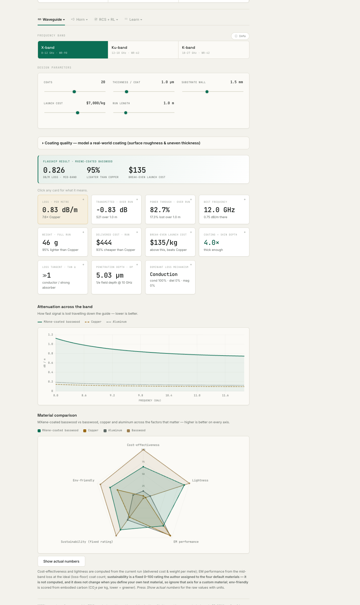
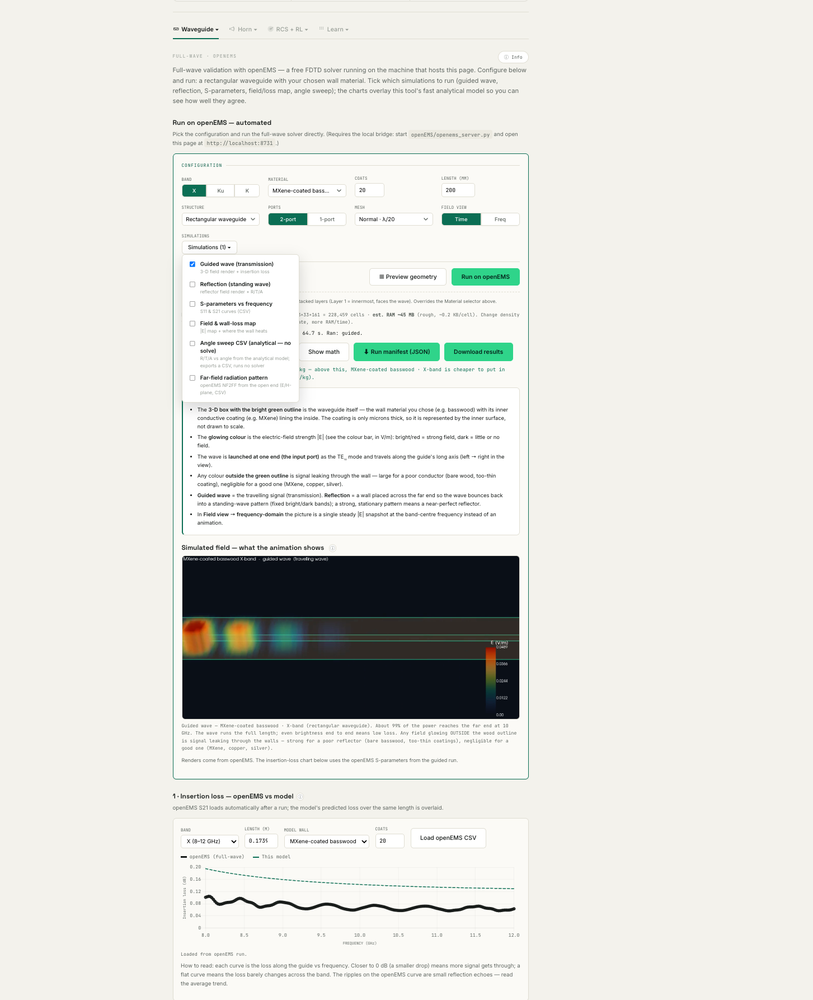
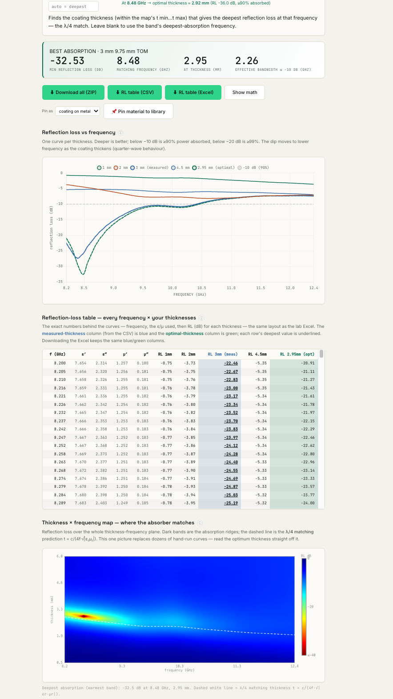
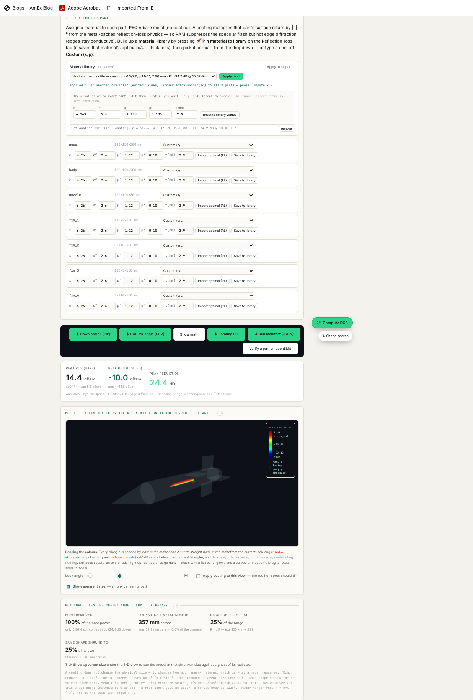
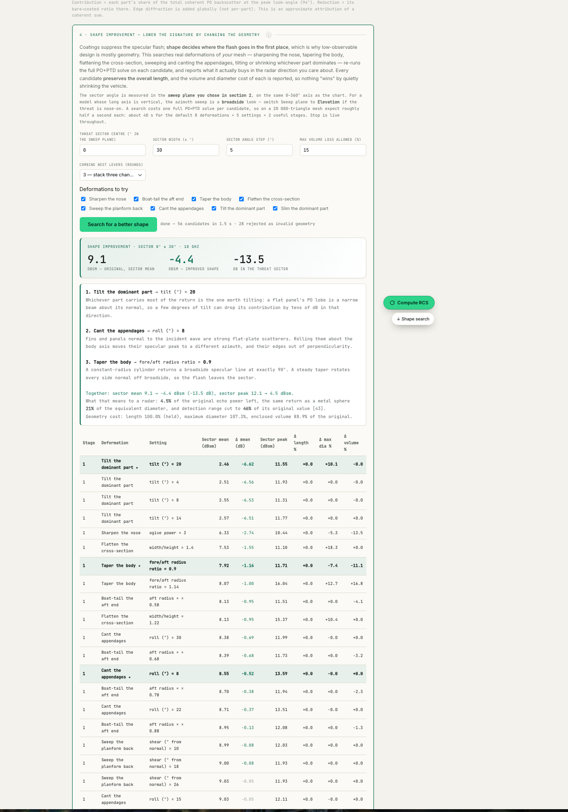
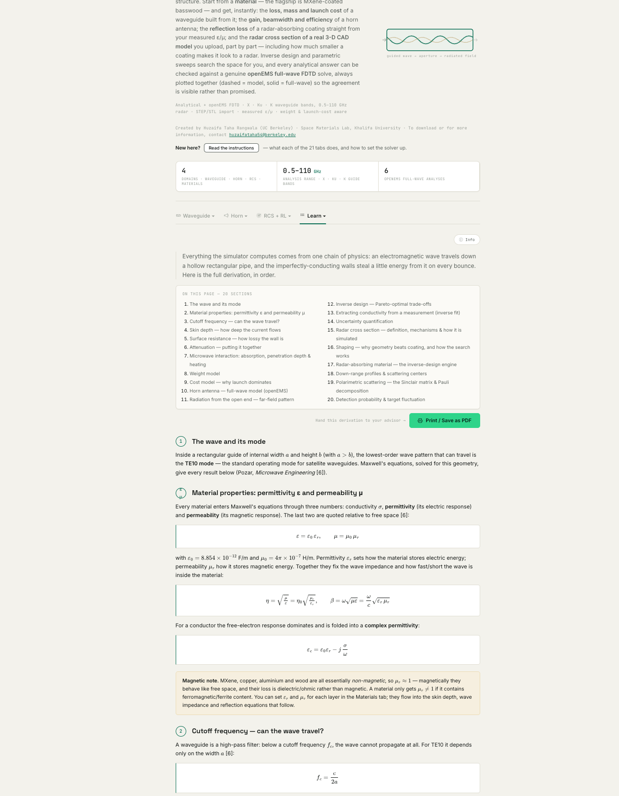

<div align="center">

# Signal to Signature

### Lightweight RF materials · Antennas · Radar signature

**A single-file web application plus an automated full-wave simulation bridge —<br>four engineering domains, two solver engines, always plotted on the same axes.**

<br>


<br>

<samp>Space Materials Lab · Khalifa University · Abu Dhabi</samp>

</div>

---

<div align="center">

### ⚡ Quick start — analytical mode, zero install

</div>

```bash
open waveguide_simulator.html          # macOS
start waveguide_simulator.html         # Windows
```

That is genuinely it. Every analytical engine — waveguide loss, horn design, reflection
loss, CAD radar cross section, the shape optimiser — runs entirely in the browser with
**no build step, no package manager, and no server**. Only the green *Run on openEMS*
buttons need the bridge in [§4](#4-full-wave-mode-the-openems-bridge).

---

## Contents

| § | Section |
|---|---|
| 1 | [What this is](#1-what-this-is) |
| 2 | [The two engines](#2-the-two-engines) |
| 3 | [The four domains](#3-the-four-domains) |
| 4 | [Full-wave mode: the openEMS bridge](#4-full-wave-mode-the-openems-bridge) |
| 5 | [Verifying your install](#5-verifying-your-install) |
| 6 | [Repository map](#6-repository-map) |
| 7 | [Configuration reference](#7-configuration-reference) |
| 8 | [Troubleshooting](#8-troubleshooting) |
| 9 | [Honest limitations](#9-honest-limitations) |
| 10 | [Citation and licence](#10-citation-and-licence) |

---

## 1. What this is

Solid copper and aluminium waveguides and horns are electrically excellent but **heavy**,
and every kilogram to orbit costs thousands of dollars. The research question behind this
project: can a **lightweight structure with a thin conductive coating** — the flagship
being MXene (Ti₃C₂Tₓ) on basswood — do the same job at a fraction of the mass?

This tool answers that quantitatively, and then goes further: it predicts a material's RF
loss, mass and launch-to-orbit cost instantly, derives radar-absorber performance from
your own laboratory measurements, and computes the radar signature of a 3-D CAD model
part by part — then lets a genuine full-wave solve check the answer.

<div align="center">



<sub><b>The Analytical Simulator.</b> Every number recomputes in the same frame as the slider moves.</sub>

</div>

---

## 2. The two engines

Everywhere the two overlap, the **analytical curve is dashed** and the **openEMS curve is
solid**, so agreement is something you can *see* rather than something you are told.

<table>
<tr><th width="50%">⚡ Engine 1 — Analytical</th><th width="50%">🌊 Engine 2 — Full-wave FDTD</th></tr>
<tr valign="top">
<td>

Closed-form microwave physics in vanilla JavaScript, in the browser.

- **Milliseconds** per evaluation
- Thousands of designs swept in seconds
- Runs offline, on a phone, with no install
- Validated against 13 textbook anchors

</td>
<td>

Real 3-D Maxwell solve via **openEMS**, driven automatically.

- **~1–3 minutes** per solve
- 6 full-wave analyses available
- Flask → GNU Octave → openEMS → NumPy/PyVista
- One solve at a time, enforced server-side

</td>
</tr>
</table>

<div align="center">



<sub><b>Both engines, one pair of axes.</b> Dashed = closed-form model · Solid = openEMS FDTD. Nothing is fitted.</sub>

</div>

---

## 3. The four domains

<table>
<tr><td width="34%">

### 📡 Waveguides
Loss, mass and launch cost for any material. TE₁₀ conductor attenuation, skin-depth and
finite-coating corrected, with a multilayer transfer-matrix stack, roughness modelling and
Monte-Carlo uncertainty.

</td><td width="33%">

### 📢 Horn antennas
Gain, beamwidth, sidelobe level and aperture efficiency by Balanis aperture integration —
pyramidal and conical. Inverse design sizes an aperture to a **target gain**.

</td><td width="33%">

### 🎯 Reflection loss
Upload a raw VNA export of complex ε and μ. Get reflection loss per thickness, the optimal
thickness, the thickness–frequency map and the effective bandwidth.

</td></tr>
</table>

<div align="center">



<sub><b>Reflection loss from measured data.</b> The dashed white line is the independent quarter-wave prediction — it lands on the absorption ridge without being fitted to it.</sub>

</div>

### 🛰️ Radar cross section — the fourth domain

Upload a **STEP or STL** model and get its monostatic radar signature against look-angle,
**part by part**, from a physical-optics facet sum with an exact closed-form phase integral
per triangle plus first-order Ufimtsev PTD edge diffraction.

<div align="center">



<sub><b>Per-facet contribution at the current look-angle.</b> Bright = this triangle is sending echo back to the radar.</sub>

</div>

Then it searches your **own geometry** for a lower signature — eight closed-form
deformation levers, coordinate descent, every candidate re-meshed and re-solved — behind a
validity gate that rejects folded surfaces, collapsed facets, excessive volume loss and
interpenetrating parts *before* a candidate is allowed to score.

<div align="center">



<sub><b>Shape improvement.</b> Length is held by construction, so nothing "wins" by quietly shrinking the object — and rejected candidates are reported, not hidden.</sub>

</div>

---

## 4. Full-wave mode: the openEMS bridge

Needed **only** for the green *Run on openEMS* buttons. Everything else already works.

### 4.1 Prerequisites

| | Component | Why | Install |
|---|---|---|---|
| 1 | **Python 3.9+** | Runs the Flask bridge and post-processing | [python.org](https://www.python.org/downloads/) |
| 2 | **GNU Octave** | Drives the solver `.m` scripts | `brew install octave` · [octave.org](https://octave.org/download) |
| 3 | **openEMS** | The FDTD Maxwell solver itself | [openems.de](https://www.openems.de/) · `brew install openems` |
| 4 | **Node.js** *(optional)* | Only to run the physics test harness | [nodejs.org](https://nodejs.org/) |

### 4.2 Python packages

```bash
pip install flask numpy matplotlib pyvista imageio imageio-ffmpeg
```

<details>
<summary><b>Why each package — and what breaks without it</b></summary>

<br>

| Package | Used for | If missing |
|---|---|---|
| `flask` | The bridge itself | **Fatal** — nothing runs |
| `numpy` | All post-processing maths | **Fatal** |
| `matplotlib` | Field animations, RCS scattered-field GIFs | Those figures fail *soft* — the solve still returns |
| `pyvista` | 3-D field volumes, rotating lobe renders, STL normalisation | 3-D visuals and STL upload degrade |
| `imageio` + `imageio-ffmpeg` | MP4 versions of every animation (**19× smaller** than GIF) | Falls back to GIF |
| `gmsh` | STEP → triangle mesh (`/upload_cad`) | STEP upload fails; **STL still works** (parsed client-side) |

On a managed system Python you may need `pip install --break-system-packages …`, or
preferably a virtual environment.

</details>

### 4.3 Start the bridge

```bash
cd "/path/to/Wave Guide Simulator"
python "openEMS/openems_server.py"
```

It prints the URL it is serving. Then — and this part matters:

> [!IMPORTANT]
> **Open `http://localhost:8731` in your browser.** Do *not* double-click the HTML file.
> The Run buttons are same-origin `fetch` calls to the bridge, so a `file://` page gets
> every analytical feature and **none** of the solver.

<details>
<summary><b>Windows quick-start</b></summary>

<br>

Two helper scripts ship in the repository root:

```bat
run_bridge.bat        :: starts the bridge with the Windows environment set
share_funnel.bat      :: exposes it over Tailscale Funnel for a remote tester
```

Windows needs a one-time setup — Octave paths, a Mesa software-OpenGL preload so
off-screen rendering works in a headless/RDP session, and the environment variables in
[§7](#7-configuration-reference). Full walkthrough: **`openEMS/WINDOWS_SETUP.md`**.

</details>

### 4.4 Run your first solve

1. Open the **Full-wave (openEMS)** tab.
2. Leave the defaults — X-band, MXene-coated basswood, 2-port.
3. Tick **Guided wave (transmission)** in the *Simulations* picker.
4. Press **Run on openEMS**. Expect **1–3 minutes**; live progress streams as it solves.
5. The insertion-loss chart loads the openEMS S-parameters automatically, with the
   analytical prediction dashed on the same axes.

> [!TIP]
> Try **CAD-RCS → Load example → `calib_sphere_100mm`** as a known-answer sanity check.
> A 100 mm calibration sphere must read ≈ **−21.4 dBsm, flat against angle**. If it does,
> your install is sound.

---

## 5. Verifying your install

The physics is guarded by a regression harness that must pass before anything ships:

```bash
node verify_math.js
```

<div align="center">

```
================ SUMMARY: 28 passed, 0 failed ================
```

</div>

Twenty-eight anchors — textbook waveguide values, reflection loss against a reference
spreadsheet, PEC-plate physical optics, horn directivity, and the CAD-RCS PO + PTD engine —
plus R/T/A energy conservation, a NaN/negative/infinity sweep, and a byte-identity check
between `cadrcs_engine.js` and the copy inlined in the HTML.

**The canary:** copper WR-90 must read **0.1084 dB/m at 10 GHz**. If that moves, something
is wrong.

<details>
<summary><b>Also worth checking after edits</b></summary>

<br>

```bash
# every inline <script> parses, and tags balance
node -e '
const fs=require("fs"),{execSync}=require("child_process");
const h=fs.readFileSync("waveguide_simulator.html","utf8");
const re=/<script(\b[^>]*)>([\s\S]*?)<\/script>/g;let m,i=0,bad=0;
while((m=re.exec(h))){if(/\bsrc=/.test(m[1]||""))continue;i++;fs.writeFileSync("/tmp/s"+i+".js",m[2]);
 try{execSync("node --check /tmp/s"+i+".js",{stdio:"pipe"});}catch(e){bad++;console.log("script#"+i,String(e.stderr).split("\n")[0]);}}
const c=s=>(h.match(new RegExp(s,"g"))||[]).length;
console.log("scripts",i,"errors",bad,"| div",c("<div\\b"),"/",c("</div>"));'
```

</details>

---

## 6. Repository map

```
.
├── waveguide_simulator.html      ← the entire app (13,162 lines: HTML + CSS + vanilla JS)
├── cadrcs_engine.js              ← PO + PTD radar-signature engine · SINGLE SOURCE OF TRUTH
├── verify_math.js                ← 28-anchor physics regression harness
│
├── openEMS/
│   ├── openems_server.py         ← Flask bridge (port 8731) · 17 routes · solve lock
│   ├── wg_run.m  wg_farfield.m   ← waveguide FDTD solvers
│   ├── rcs_run.m                 ← radar cross section (plane-wave + NF2FF)
│   ├── render_field*.py          ← field animations and stills
│   ├── render_rcs.py             ← scattered-field GIF/MP4 + rotating lobe
│   ├── cad/
│   │   ├── horn_run.m            ← horn FDTD: gain, patterns, S11, 3-D field
│   │   ├── step_facets.py        ← STEP → segmented triangle mesh (gmsh/OCC)
│   │   ├── export_field3d.py     ← Ev volume → compact JSON for the 3-D viewer
│   │   └── horn_report.py        ← derived antenna metrics + Excel export
│   ├── SETUP.md                  ← environment notes
│   └── WINDOWS_SETUP.md          ← Windows install + Tailscale Funnel walkthrough
│
├── demo_cad/                     ← 9 multi-body STEP demo models (see below)
├── pwa/                          ← manifest, service worker, icons
├── docs/screenshots/             ← the figures used in this README
│
├── user_guide.docx               ← full user guide (English)
├── user_guide_ar.docx            ← full user guide (Arabic, RTL)
├── Simulator_Overview.docx       ← technical overview, 13 figures
├── CITATION.cff                  ← Citation File Format
└── GIT_WORKFLOW.md               ← cross-machine workflow (git is the only channel)
```

<details>
<summary><b>The nine demo CAD models</b></summary>

<br>

| Model | Purpose |
|---|---|
| `calib_sphere_100mm` | **Known answer** — must read ≈ −21.4 dBsm, flat vs angle |
| `rocket` · `missile_seeker` | Multi-part bodies with fins — good shape-search targets |
| `stealth_ucav` | Planform-sweep and boat-tail levers pay off dramatically here |
| `drone_quad` | Small multirotor — the counter-UAS signature case |
| `satellite` · `cone_tube` · `water_bottle` | General multi-body geometry |
| `corner_test_dihedral` | **Honesty exhibit** — a dihedral retroreflects via multiple bounces, which this engine has no term for, so it measurably *under*-reports it |

</details>

---

## 7. Configuration reference

Every path is OS-portable: the server derives its project root from `__file__`, and all
machine-specific values come from environment variables **with the macOS values as
defaults** — so an unset environment leaves a Mac working unchanged.

| Variable | Default | Purpose |
|---|---|---|
| `OPENEMS_OCTAVE` | macOS Homebrew path | GNU Octave executable |
| `OPENEMS_PYTHON` | macOS path | Python used for post-processing children |
| `OPENEMS_SCRATCH` | `/tmp/...` (Win: `C:\openems_scratch`) | Solver scratch dir — **must be space-free** |
| `OPENEMS_MATLAB_PATH` | macOS path | openEMS Octave interface |
| `CSXCAD_MATLAB_PATH` | macOS path | CSXCAD Octave interface |
| `OPENEMS_HOST` | `127.0.0.1` | Bind address — `0.0.0.0` for LAN access |
| `OPENEMS_PORT` | `8731` | Bridge port |
| `OPENEMS_THREADED` | on | Keep on, or `/progress` cannot be polled during a solve |
| `OPENEMS_FIELD_RENDER` | `surface` on Windows | `volume` \| `surface` cut-plane rendering |

`127.0.0.1` is sufficient behind **Tailscale Funnel** — all client↔bridge calls are
relative, so the whole app works unchanged over a Funnel HTTPS origin.

---

## 8. Troubleshooting

<details>
<summary><b>The green Run buttons do nothing / say the bridge is unreachable</b></summary>

<br>

You are almost certainly on a `file://` page. Open **`http://localhost:8731`** instead.
If the bridge *is* running and you are on the right URL, check its terminal output — the
app surfaces the server's own error stage rather than a generic failure.

</details>

<details>
<summary><b>A second Run returns HTTP 409</b></summary>

<br>

Working as intended. The bridge holds a real `threading.Lock` around `/run`, `/run_horn`
and `/run_rcs` because it writes to fixed scratch paths — two concurrent solves would
corrupt each other. Wait for the first to finish.

</details>

<details>
<summary><b>Charts are blank, or an animation shows the previous run</b></summary>

<br>

Both are handled, but the underlying cause is worth knowing: browsers **pause
`requestAnimationFrame` in a hidden or backgrounded tab**, so a solve that finishes while
you are on another tab may not paint. Bring the tab forward — repaint is forced on
`visibilitychange`. Animations are MP4-first (19× smaller than GIF) and the figure is
blanked at run start, so a stale frame should not survive.

</details>

<details>
<summary><b>STEP upload fails but STL works</b></summary>

<br>

STL is parsed client-side; STEP needs `gmsh` server-side via `/upload_cad`.
Install it: `pip install gmsh`.

</details>

<details>
<summary><b>A solve runs forever</b></summary>

<br>

Usually a mesh problem: near-coincident grid lines create a tiny cell that collapses the
CFL timestep by ~10×. The sphere/cylinder/dihedral branches drop linspace points within
half a cell of a seeded boundary line to prevent exactly this. Also check the
**electrical-size guard** — FDTD here is for small canonical targets, and `/run_rcs`
refuses a target whose half-extent exceeds 5·λ_min.

</details>

<details>
<summary><b>Windows: off-screen rendering crashes</b></summary>

<br>

Expected without the Mesa software-OpenGL preload — a headless or RDP-disconnected Windows
session has no pixel format and VTK aborts. The renderers contain
`if os.name == "nt":` blocks that handle this; **do not strip them** (they are no-ops on
macOS and Linux). See `openEMS/WINDOWS_SETUP.md`.

</details>

---

## 9. Honest limitations

Stated plainly, because the tool's credibility is its honesty. Every figure in the app is
labelled **analytical**, **full-wave** or **measured**, and every constant carries a
numbered citation to one of ~51 references.

- **MXene-coated basswood is not yet hardware-validated.** It is checked against textbooks
  and openEMS only. The *Measurement fit* tab (upload a VNA `.s2p`, extract effective σ) is
  the intended hardware validator.
- **CAD-RCS models specular reflection and first-order edge diffraction only.** No multiple
  bounces or cavities (corner reflectors, nozzles), no creeping or travelling waves, no tip
  diffraction, and shadowing is per-facet by surface normal rather than true ray occlusion.
  `demo_cad/corner_test_dihedral.step` exists to demonstrate this failure honestly.
- **The shape-improvement validity gate is geometry only.** It says nothing about
  aerodynamics, structures, packaging, control authority, thermal or manufacturability.
- **S11 near cutoff** is a numerical waveguide-port artefact, not a real reflection.
- **Space-survival checks are first-order screens**, not qualification. MXene's
  secondary-electron yield is essentially unmeasured — an open question.
- **Out-of-band ε/μ is held at the measured edge and labelled `extrapolated`**, never
  reported as data.

---

## 10. Citation and licence

<div align="center">



<sub><b>Nothing is a black box.</b> Twenty sections of derivation, every equation cited, printable to PDF.</sub>

</div>

If this work supports a publication, please cite it. Machine-readable metadata lives in
[`CITATION.cff`](CITATION.cff), and the app's **References** tab generates the same record.

```
Rangwala, H. T. (2026). Signal to Signature — EM Waveguide & RCS Simulator, v4.0.
Space Materials Lab, Khalifa University, Abu Dhabi.
```

> [!NOTE]
> **Licence status: proprietary, pending institutional review.**
> `CITATION.cff` declares `LicenseRef-Proprietary-KU-affiliation-pending`. No open-source
> licence has been granted yet — open-sourcing is planned once IP is cleared with the
> Khalifa University affiliation. Until then, please ask before reusing or redistributing.

---

<div align="center">

<br>

**Huzaifa Taha Rangwala**
<br>
<sub>UC Berkeley (Mathematics + Computer Science) · Visiting Researcher / SWE, Khalifa University</sub>
<br>
<sub><a href="mailto:huzaifataha54@berkeley.edu">huzaifataha54@berkeley.edu</a></sub>

<br>

<sub><b>KHALIFA UNIVERSITY · جامعة خليفة</b></sub>
<br>
<sub>Built with openEMS, GNU Octave, NumPy, Three.js and Chart.js.</sub>

</div>
